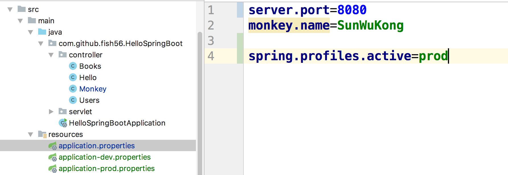

## 配置文件

因为`.properties` 和`.yml` 只是格式不同，后面只会用`.properties`格式来演示，`.yml`的读者可以自行使用


我们在Overview这个章节中已经创建了`application.properties`这个文件

- 这是默认的配置文件。名字是固定的，你可以通过一些方法修改这个配置文件的名字，但是没必要

- 标准的说法是把配置文件放在classpath中，Spring Boot就会自动读取。

  但是说的直白点，你把这个文件放在mvn工程的`resource` 目录下就行。

- 有些字段是被Spring Boot使用的，你重写了这些字段，就等于修改的Spring Boot的默认配置。

  比如 `server.port`

- 用户可以自定义字段，然后读取。

``` java
public class Monkey {

    @Value("${monkey.name}")
    private String name;

    @GetMapping
    public String getMonkey(){
        return name;
    }
}
```

就想我们在Overview中演示的一样，通过` @Value("${monkey.name}")`这个注解可以拿到相关的配置信息。

## 多环境配置

但是我们知道我们在开发环境和线上环境的配置往往不一样，比如说数据的url。如果我们每次上线前手动的修改配置，非常容易出错，Spring Boot允许我们创建多个配置文件在不同的环境中使用。


1. 在resource目录下创建`application-dev.properties`这个文件

   文件名必须满足`application-{...}.properties`这个格式，并且添加下面的字段


2. 在`application.properties`告知Spring Boot我们要把`application-dev.properties`当做我们的配置文件用。添加`spring.profiles.active`即可

   

我们添加了 `spring.profiles.active`这个字段，并给它的值赋值为dev，这个我们之前创建的文件名是一致的

3. 在我们的代码中读取相关的值

   

这个样我们就能读取到这个配置信息了

4. 测试

   

果然读取到了。


#### 新的配置文件

同样的方法，我们创建一个`application-prod.properties`文件，并指明一个新的数据库url，同时，我们再来看下结果




记得修改`application.properties`,告知Spring Boot 我们修改了配置文件


可以看到，我们在代码中读取到的配置信息确实发生了变化。

不过上面的做法还是有点不好的地方，那就是我们要不停的修改`application.properties`文件。

下一小节我们将会从shell中读取变量。


## Git

```bash
$ git log
commit 575d8714e0418b933942e0ea81b571177efe9a4d 

    full config

$ git show 575d
```

读者可以前往`config`这个branch 的这个 commit来查看代码的变动。

