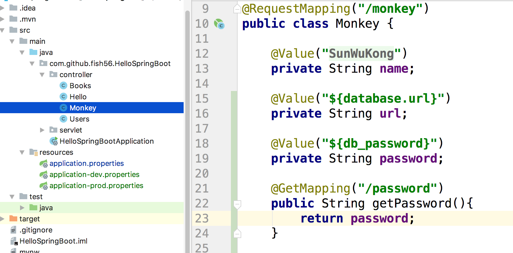
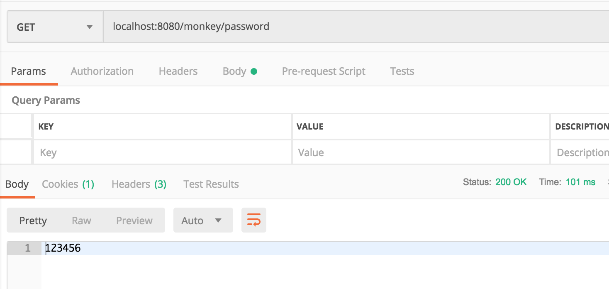
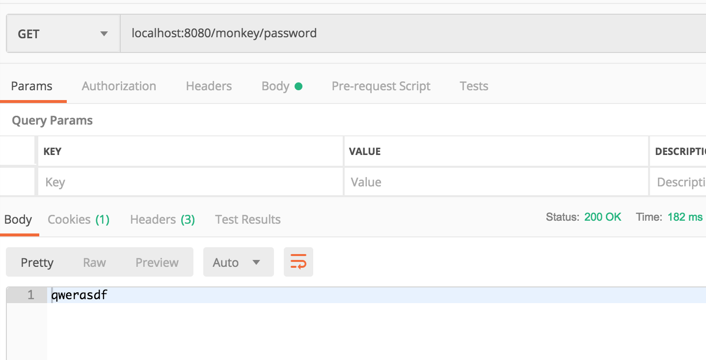

# Shell 变量

我们的数据库密码一般不会写到源代码中，这样很不安全。

我们在Monky这个controller中添加这样的字段



然后我们在对应的shell 中设置环境变量，为清楚一点，这次我们直接在命令行中手动的启动我们的Spring Boot程序

``` shell
$ export db_password=123456

$ mvn install

$ java -jar ./target/HelloSpringBoot-0.0.1-SNAPSHOT.jar
```



可以看到，我们确实读取到了shell变量，这在线上线下的开发中很有用


## 命令行参数

有的时候，我们可能好希望通过命令行参数来修改配置。我们可以退出上面启动的程序，通过这种方式重启

``` shell
$ java -jar ./target/HelloSpringBoot-0.0.1-SNAPSHOT.jar --db_password=qwerasdf
```

命令行参数的优先级高与我们之前说的几种配置方式，好，我们来看一下结果





### 多环境

同样的，我们可以传入`spring.profiles.active`这个参数，来决定我们的配置文件，而不用修改`applicaton.properties`这个文件

```bash
$ java -jar ./target/HelloSpringBoot-0.0.1-SNAPSHOT.jar --spring.profiles.active=dev
```

通过这个手段，我们无需变动 `applicaton.properties`就按将配置文件做了修改。