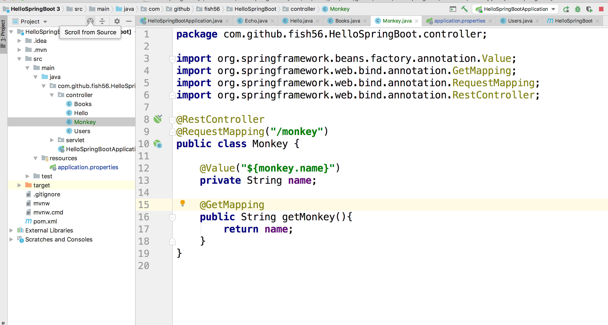
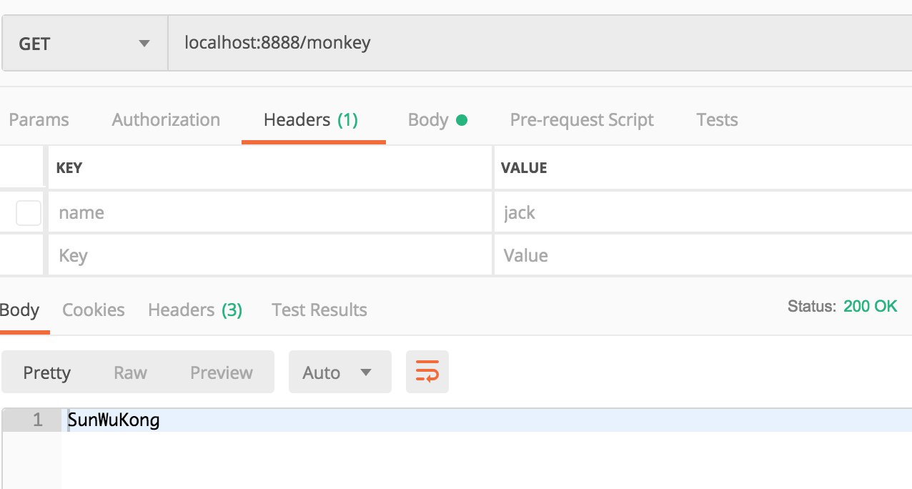

# config
Spring Boot 默认读取 `resource` 目录下的``application.properties` 来作为配置信息，我们可以通过这个文件覆盖默认的配置。

``.properties`文件基本的写法是键-值对的形式

```
server.port=8888
monkey.name=SunWuKong
```
在application.properties中添加上述信息，我们配置的`server.port`就会覆盖默认的配置，重新启动的时候应用程序就会使用`8888`端口。

同时我们在配置文件中自定义了一个字段，如果我们想读取的话，我们可以：
创建一个Monky类

``` java
package com.github.fish56.HelloSpringBoot.controller;

import org.springframework.beans.factory.annotation.Value;
import org.springframework.web.bind.annotation.GetMapping;
import org.springframework.web.bind.annotation.RequestMapping;
import org.springframework.web.bind.annotation.RestController;

@RestController
@RequestMapping("/monkey")
public class Monkey {
    
    @Value("${monkey.name}")
    private String name;

    @GetMapping
    public String getMonkey(){
        return name;
    }
}
```
可以通过`@Value`这个注解给属性注入值。




为了后续教程的统一，记得把端口还会来，依旧使用8080端口。

## Git 版本

``` bash
$ git checkout conf
$ git diff request conf 
```