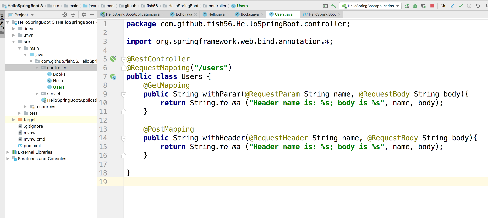
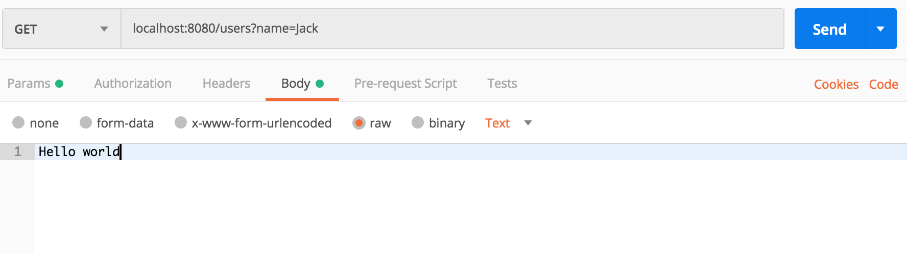

# Request
接下来，我们来看看如何使用注解来获得请求头相关的信息。

与之相关的这三个用于给参数注解的注解
- @RequestHeader
  Spring Boot会把对应的请求头的信息注入到这个参数中
- @RequestBody
  请求体会被传递给这个参数
- @@RequestParam
  对应的查询字符串的值会被传递给这个参数

废话不多说，直接上代码
``` java
package com.github.fish56.HelloSpringBoot.controller;

import org.springframework.web.bind.annotation.*;

@RestController
@RequestMapping("/users")
public class Users {
    @GetMapping
    public String withParam(@RequestParam String name, @RequestBody String body){
        return String.format("Header name is: %s; body is %s", name, body);
    }

    @PostMapping
    public String withHeader(@RequestHeader String name, @RequestBody String body){
        return String.format("Header name is: %s; body is %s", name, body);
    }
}
```




注意，如果你查询字符串的参数写的是 `name=jack`,那么你传递
参数的时候，那个变量名也要是`name`,不然在多参数的情况就会
产生歧义，SB就不知道怎么办了。

## Git 版本
``` bash
$ git checkout request
$ git diff request router-params
```