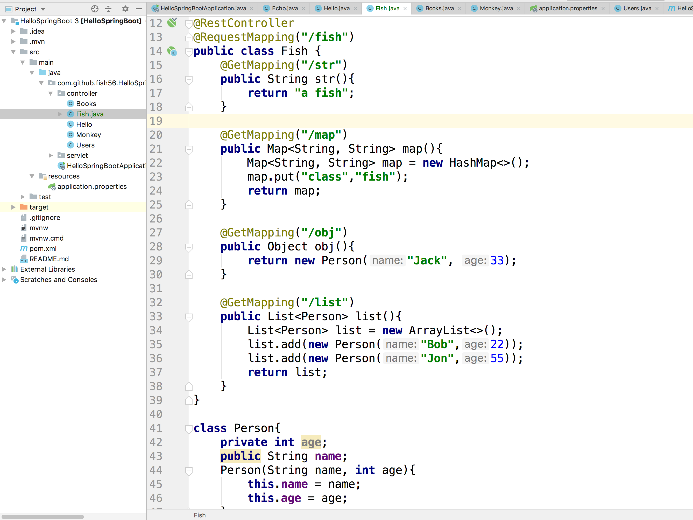
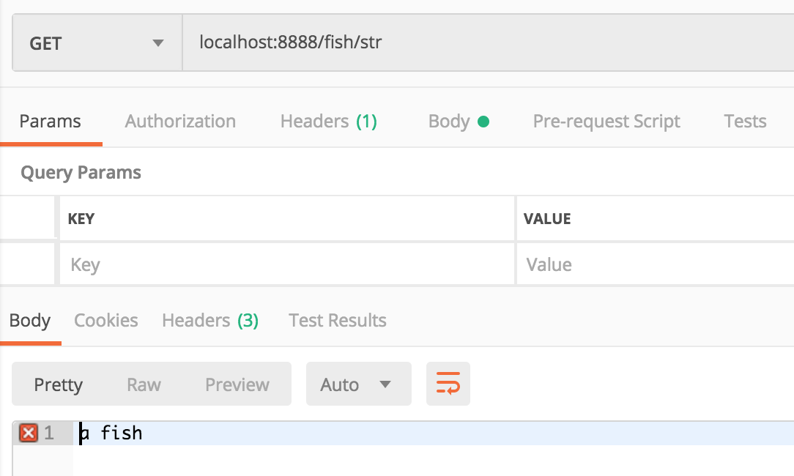
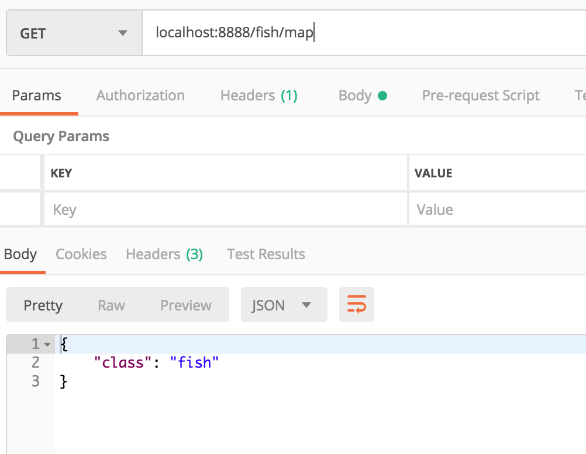
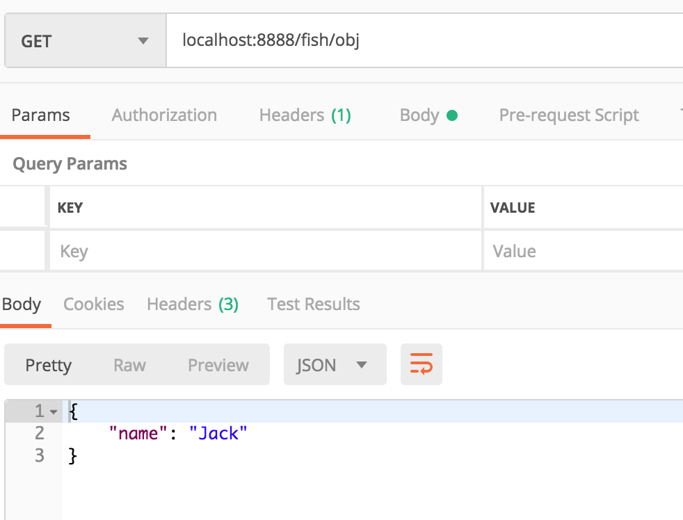
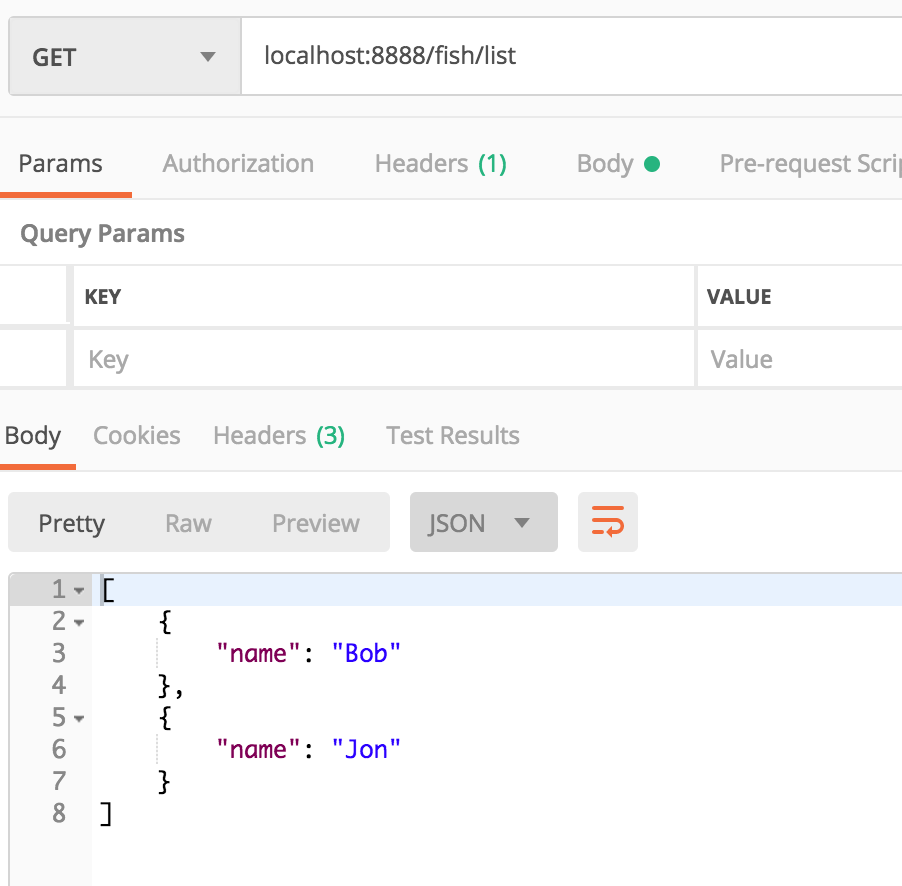

# Response
接下来我们说一下如何设置响应体。

Spring Boot会根据我们的返回值类型帮我们智能的处理响应。之前我们的路由方法返回都是String类型，Spring Boot就会把这个string写到响应体里面，同时设置响应头部`Content-Type : text/plain;charset=UTF-8`。

但是我们知道，现在前后端分离开发，HTTP报文格式一般要使用JSON格式。而JSON是从JavaScript
中发展来的，Java中处理JSON一直不是很舒服。所幸的是，Spring Boot给我们提供
了非常智能轻松的处理方式。它能够根据路由方法的返回值帮我们处理数据。

我们知道JSON除了数字、字符、null，也就是数组和键值对。而Java中的对象 Map本质上也是一种键值对
所以：

- 如果路由方法返回的是一个Map 或 Object类型，Spring Boot能自动的帮我们转化
  为JSON的键值对，并帮我们设置响应头部的Content-Type `Content-Type →application/json;charset=UTF-8`.
-  如果路由方法返回的是一个List类型,Spring Boot也能自动的帮我们转化
  为JSON的数组，并帮我们设置响应头部的Content-Type.


``` java
@RestController
@RequestMapping("/fish")
public class Fish {
    @GetMapping("/str")
    public String str(){
        return "a fish";
    }

    @GetMapping("/map")
    public Map<String, String> map(){
        Map<String, String> map = new HashMap<>();
        map.put("class","fish");
        return map;
    }

    @GetMapping("/obj")
    public Object obj(){
        return new Person("Jack", 33);
    }

    @GetMapping("/list")
    public List<Person> list(){
        List<Person> list = new ArrayList<>();
        list.add(new Person("Bob",22));
        list.add(new Person("Jon",55));
        return list;
    }
}

class Person{
    private int age;
    public String name;
    Person(String name, int age){
        this.name = name;
        this.age = age;
    }
}
```
代码如图所示


#### 返回值为字符型:



#### 返回值为map类型:



#### 返回值为对象类型:



我们可以看到private字段默认是不解析的

#### 返回值为list类型


List类型自动解析为JSON数组，而且还能递归，这在开发中太舒服了。

## Git 版本

``` bash
$ git checkout response
$ git diff request response 
```