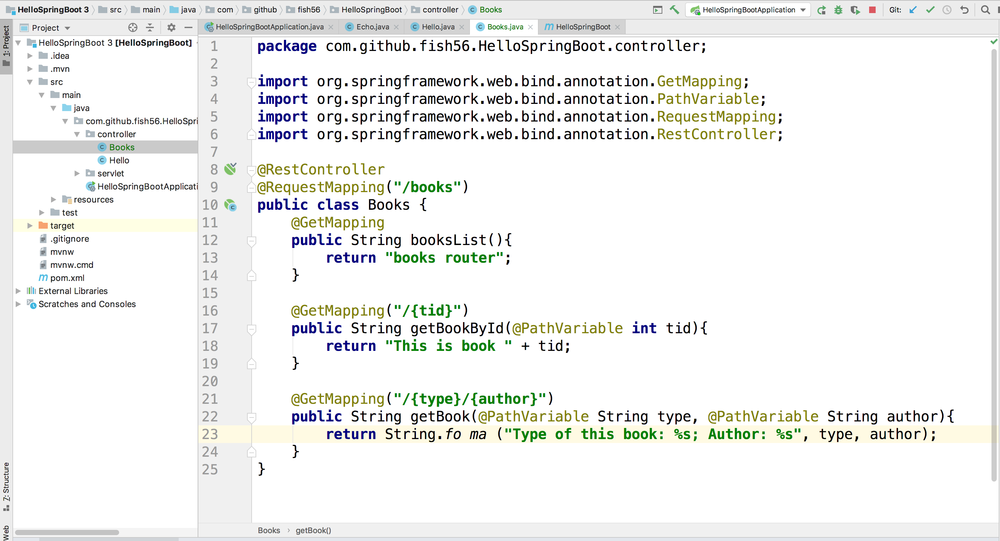
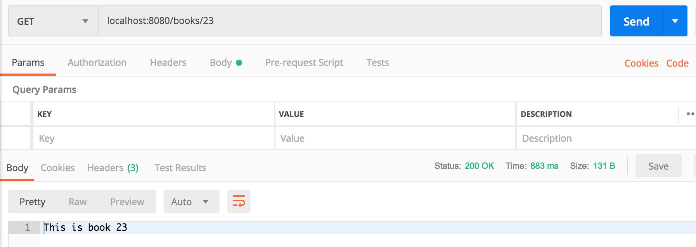
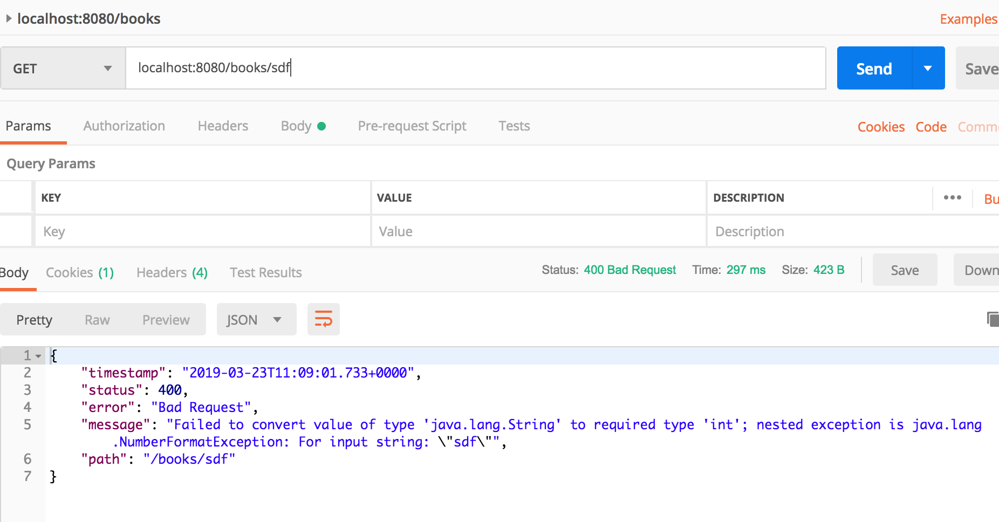
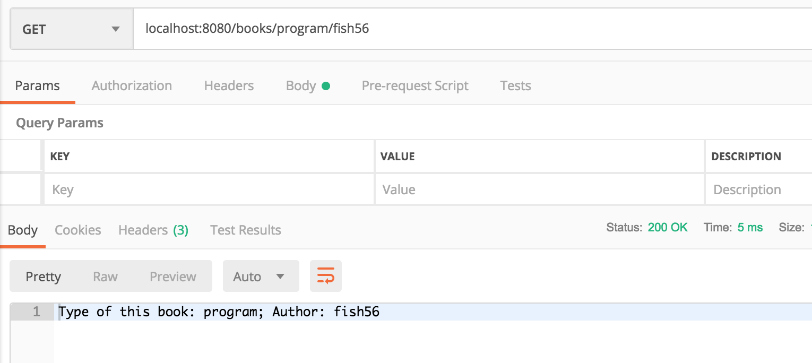

# 路由参数
设置动态路由时Web来发中非常常用的需求。

在Spring 中配置路由参数很简单

``` java
@GetMapping("/{tid}")
public String getBookById(@PathVariable int tid){
  return "tid: " + tid;
}
```
我们只要使用花括号将路由中的名称括起来，Spring就会把它当做是
一个变量。然后我们在方法的参数中通过`@PathVariable`给我们的
变量添加注解，SpringBoot在运行时就会把读取到的变量的值传递给
我们的方法。

创建下面的类。这是一个books的路由，用户可以通过书的tid或者
书类型+作者来访问书的信息。

``` java
package com.github.fish56.HelloSpringBoot.controller;

import org.springframework.web.bind.annotation.GetMapping;
import org.springframework.web.bind.annotation.PathVariable;
import org.springframework.web.bind.annotation.RequestMapping;
import org.springframework.web.bind.annotation.RestController;

@RestController
@RequestMapping("/books")
public class Books {
    @GetMapping
    public String booksList(){
        return "books router";
    }

    @GetMapping("/{tid}")
    public String getBookById(@PathVariable int tid){
        return "This is book " + tid;
    }

    // 同时我们也可以使用嵌套路由
    @GetMapping("/{type}/{author}")
    public String getBook(@PathVariable String type, @PathVariable String author){
        return String.format("Type of this book: %s; Author: %s", type, author);
    }
}
```
记得路由中的变量名要和方法参数中的变量名相同，不然Spring Boot无法解析。当然你可以通过配置来使得它们不同，但是没必要，不推荐。


下面是代码的截图：



#### 动态ID：



我们在路由方法中要求tid是int类型，所以假如你传递一个字符串，SpringBoot就无法解析，它会返回给你一个400错误的信息。


#### 通过嵌套路由来发起请求：



## Git 版本

``` bash
$ git checkout router-params
$ git diff servlet router-params 
```