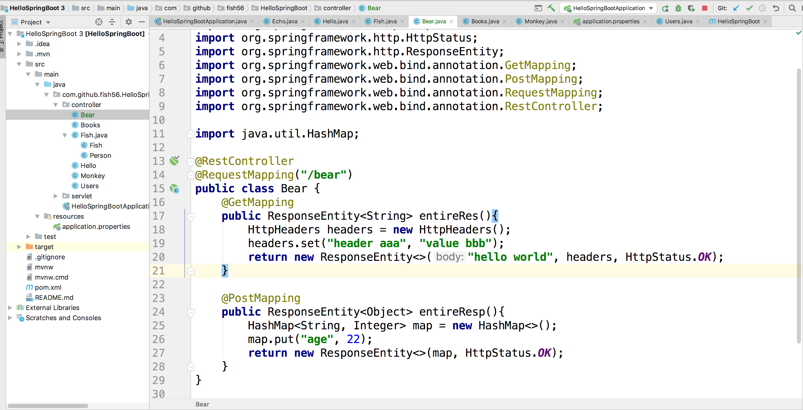
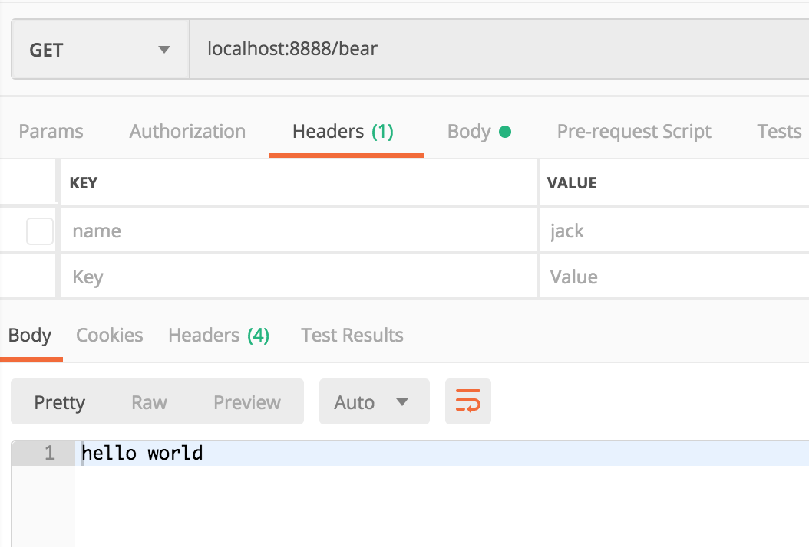
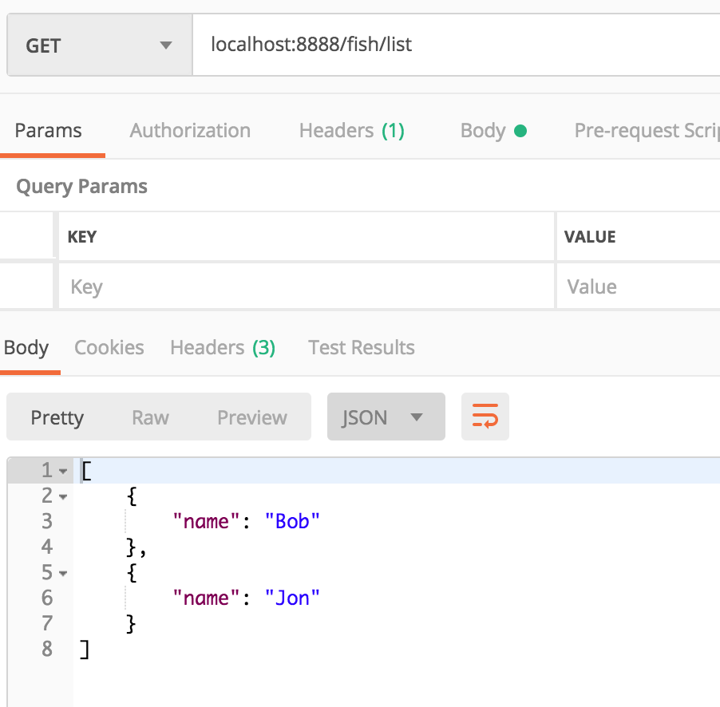

# 响应头和状态码
那我们如何设置响应头部和状态码呢？

之前我们说过，Spring Boot 会根据路由函数的
返回值智能的帮我们设置响应体。我们可以让路由方法
返回一个特殊的类型`ResponseEntity`来设置状态码。

先看代码：

``` java
package com.github.fish56.HelloSpringBoot.controller;

import org.springframework.http.HttpHeaders;
import org.springframework.http.HttpStatus;
import org.springframework.http.ResponseEntity;
import org.springframework.web.bind.annotation.GetMapping;
import org.springframework.web.bind.annotation.RequestMapping;
import org.springframework.web.bind.annotation.RestController;

@RestController
@RequestMapping("/bear")
public class Bear {
    @GetMapping
    public ResponseEntity<String> entireRes(){
        HttpHeaders headers = new HttpHeaders();
        headers.set("header aaa", "value bbb");
        return new ResponseEntity<>("hello world", headers, HttpStatus.OK);
    }
}
```

在上面的情况中，我们创建了一个`HttpHeaders`对象，
同时我们返回了一个`ResponseEntity<String>`的实例。
在我们创建`ResponseEntity<>`对象的时候，我们给它传了
三个参数，第一个参数会被当做响应体，第二要传入http头部
最后一个是状态码。
直接看结果






而`ResponseEntity<>`本身是个泛型，如果
它中间填的是Object 或 Map，那么Spring Boot还是
按照上一个小结的规则来处理。



## Git 版本
``` bash
$ git checkout status
$ git diff status response
```