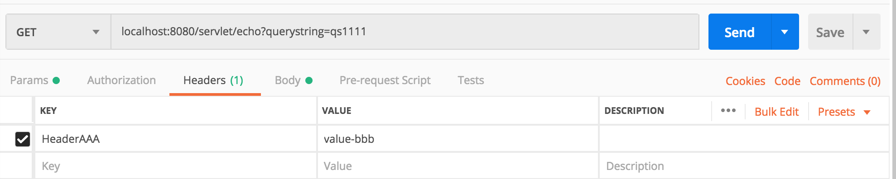
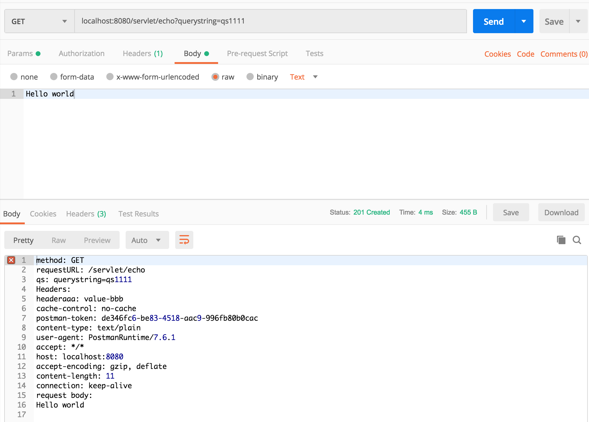

# servlet
在说如何使用Spring注解风格来处理请求
响应之前，我们先看看使用传统的servlet
是如何工作的
- 对servlet一点也不懂的可以跳过
- 对servlet非常熟悉的可以跳过

Spring Boot是建立在servlet技术之上的，
而且SB运行我们直接使用servlet来处理
请求，创建下面的包和类
``` java
package com.github.fish56.HelloSpringBoot.servlet;

import javax.servlet.ServletInputStream;
import javax.servlet.annotation.WebServlet;
import javax.servlet.http.HttpServlet;
import javax.servlet.http.HttpServletRequest;
import javax.servlet.http.HttpServletResponse;
import java.io.IOException;
import java.io.PrintWriter;
import java.util.Enumeration;

@WebServlet(urlPatterns = "/servlet/echo")
public class Echo extends HttpServlet {
    @Override
    protected void doGet(HttpServletRequest request,
                         HttpServletResponse response) throws IOException {
        String method = request.getMethod();
        String requestUrl = request.getRequestURI();
        String qs = request.getQueryString();
        Enumeration<String> headerNames = request.getHeaderNames();
        ServletInputStream in = request.getInputStream();

        PrintWriter out = response.getWriter();
        out.println("method: " + method);
        out.println("requestURL: " + requestUrl);
        out.println("qs: " + qs);
        out.println("Headers: ");
        while (headerNames.hasMoreElements()){
            String name = headerNames.nextElement();
            out.println(name + ": " + request.getHeader(name));
        }

        out.println("request body: ");
        byte[] bytes = new byte[200];
        int length = 1;
        while (length != -1){
            length = in.read(bytes);
            if(length > 0){
                out.println(new String(bytes, 0, length));
            }
        }
        response.setStatus(201);
        response.setHeader("hello","world");
    }
}
```
熟悉servlet的同学肯定知道，上述的代码就是获得HTTP请求与相应的
关键信息。
我们通过request读取到请求的头部和请求体，然后把相关的信息放到
了响应体里面。

同时记得在HelloSpringBootApplication.java 添加这样的注解
``` java
@ServletComponentScan(basePackages = "com.github.fish56.HelloSpringBoot.servlet")
@SpringBootApplication
public class HelloSpringBootApplication {
  // ...
}
```
这行代码告知SB要在com.github.fish56.HelloSpringBoot.servlet
这个包里面搜索servlet处理器。

我们使用postman来尝试访问这个路由，试一下。
在postman中，我们发起了一个get请求，并给它设置
了查询字符串、请求头，请求体。



看到，我们确实可以通过传统的方法来处理请求和相应。
但是这种方式比较臃肿，Spring Boot提供了很多的注解，我们
可以使用这些注解进行依赖注入。

下面我们来面对注解编程吧。

## Git 版本
``` bash
$ git checkout servlet
$ git diff servlet init
```