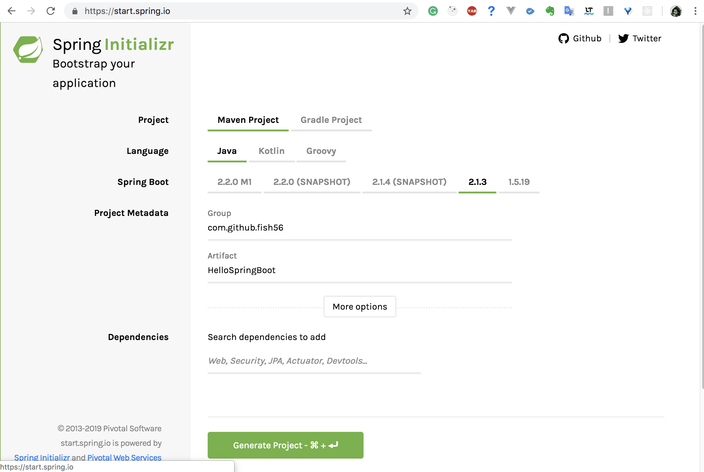
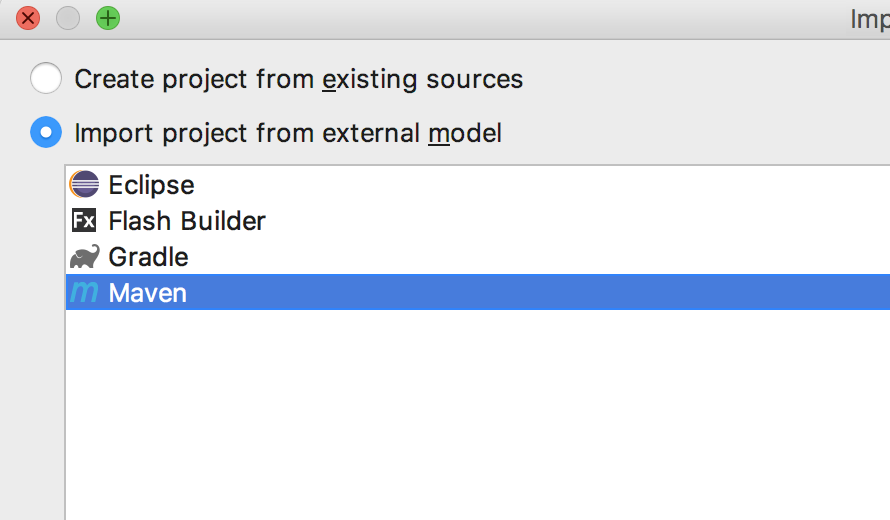
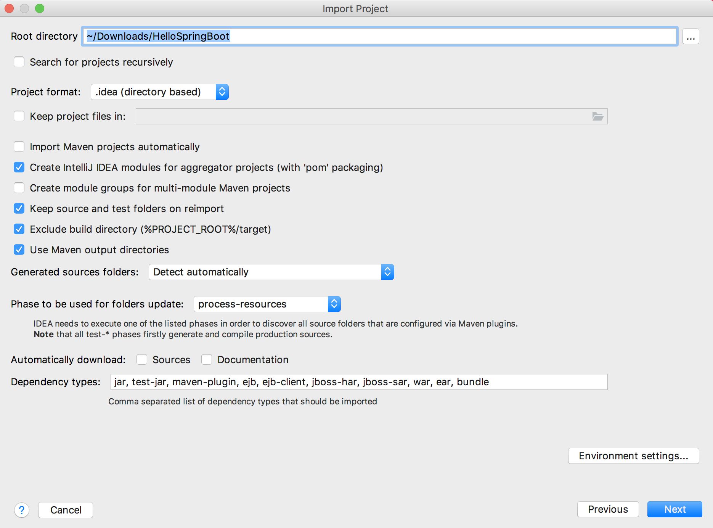
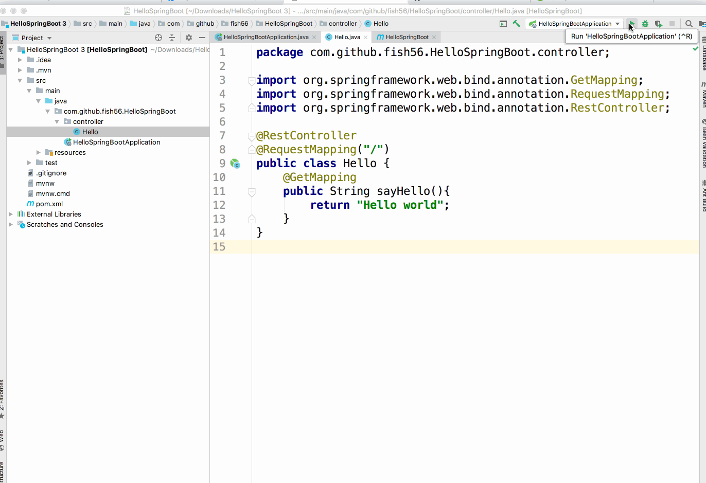

# 初始化项目 
Spring Boot 官方提供了一个在线生成模板的工具
https://start.spring.io/

进入这个页面，填写你自己的`GroupId`以及`ArtifactID`。
然后点击 `Genrate Project` 这个按钮，不出意外的话你会
开始下载一个 `.zip` 文件.


## 目录结构
解压这个文件，你会看到下面的文件目录结构。

```
.
├── mvnw
├── mvnw.cmd
├── pom.xml
└── src
    ├── main
    │   ├── java
    │   │   └── com
    │   │       └── github
    │   │           └── fish56
    │   │               └── HelloSpringBoot
    │   │                   └── HelloSpringBootApplication.java
    │   └── resources
    │       └── application.properties
    └── test
        └── java
            └── com
                └── github
                    └── fish56
                        └── HelloSpringBoot
                            └── HelloSpringBootApplicationTests.java

```
这是一个典型的Maven工程项目目录结构。

## 导入到IDE
下面以IDEA为例演示如何导入。
打开IDEA,点击 `import a project`，然后
一路next就行了





## 补充代码
在启动之前，我们还要添加一个web开发依赖的jar包。
在pom.xml中添加下面的依赖
``` xml
<dependency>
	<groupId>org.springframework.boot</groupId>
	<artifactId>spring-boot-starter-web</artifactId>
</dependency>
```
然后创建下面的类，注意，我其实还创建了controller这个包，
后面我就不说了因为它被暗含在类的包名里面。
（不用理解代码，后面会有详细说明）
``` java
package com.github.fish56.HelloSpringBoot.controller;

import org.springframework.web.bind.annotation.GetMapping;
import org.springframework.web.bind.annotation.RequestMapping;
import org.springframework.web.bind.annotation.RestController;

@RestController
@RequestMapping("/")
public class Hello {
    @GetMapping
    public String sayHello(){
        return "Hello world";
    }
}
```

## 启动
我们可以在当前目录的命令行使用mvn打包项目，
然后直接执行生成的jar包

``` bash
mvn install
java -jar target/HelloSpringBoot-0.0.1-SNAPSHOT.jar
```
或者，我们可以直接点击IDEA的开始按钮


不出意外的话，当你访问localhost:8080的时候，你应该能够看到
Hello World的字样。

应为Spring Boot打包了Tomcat这样的servlet容器，所以启动的有
点满，请耐性等待。

如果你对代码有些不确定，可以使用下面的代码来确认
我这一步骤产生的代码。
```
git checkout init
```